# Overview
SimpleNote is a lightweight and user-friendly note-taking application designed to help you capture and organize your thoughts, ideas, and important information. With its clean and intuitive interface, you can quickly jot down notes, create to-do lists, and set reminders, making it the perfect tool for staying organized and productive.

# Features
- User’s account
  - Create a new account using an email & password
  - Sign into an existing account using email & password
  - Reset the password of the existing account
- User’s notes
  - View notes which is saved in the firebase database
  - Add a new note and save it in the database
  - Edit the existing note and update it into the database
  - Delete a note
- User’s tasks
  - View task which is saved in the firebase database
  - Mark a task as completed or unmark if it is not completed yet
  - Add a new task and save it in the database
  - Edit the existing task and update it into the database
  - Delete a task

# UML diagram
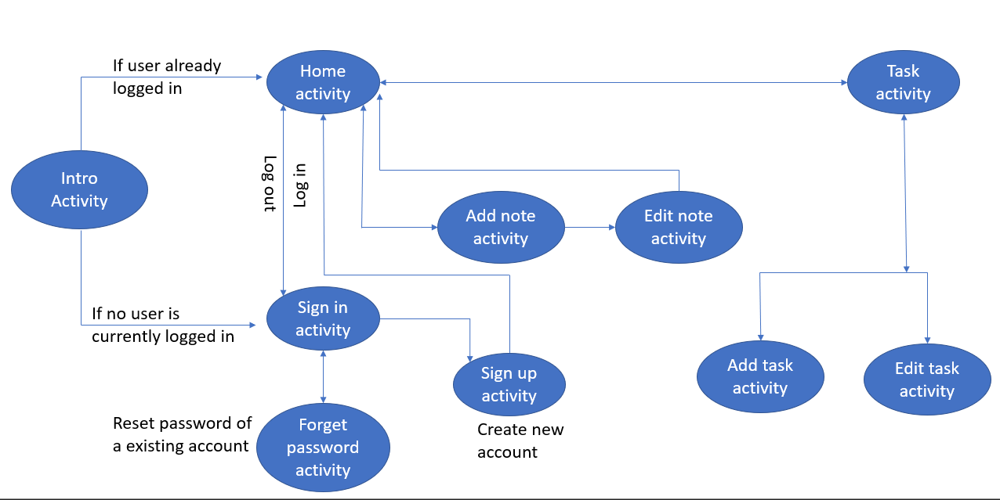

# Sign Up
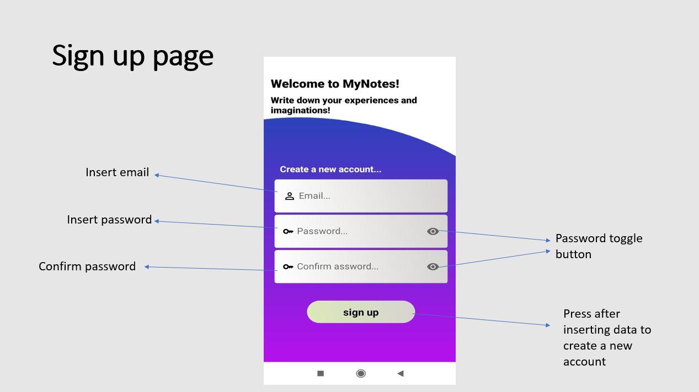

# Sign In
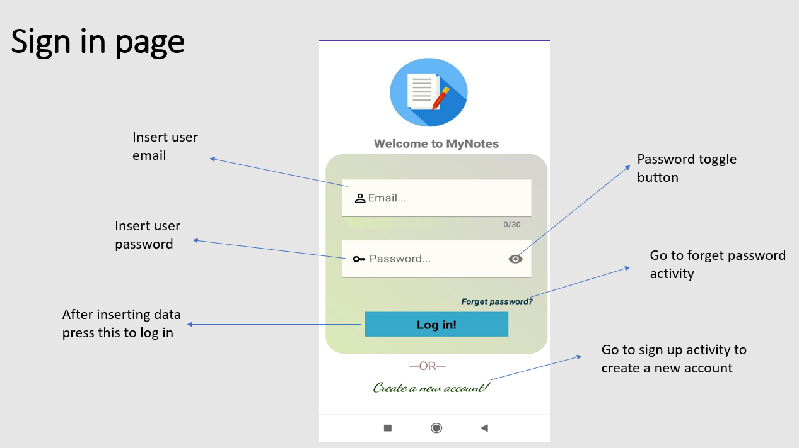

# Forget Password
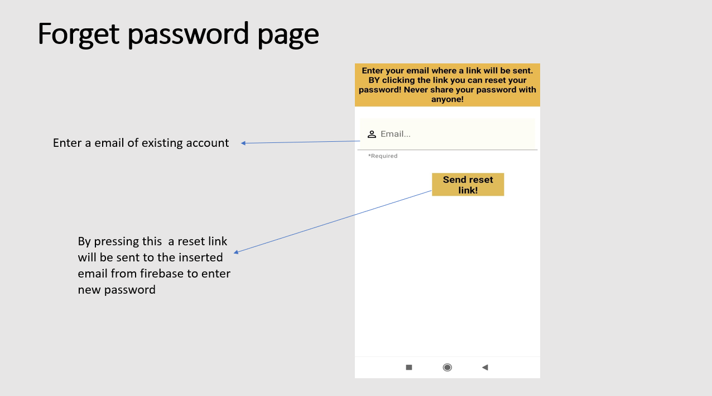

# Home
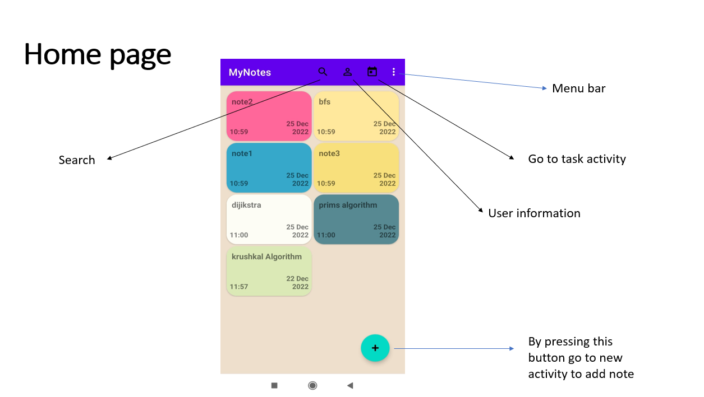

# Add Note

# Firebase Firestore Database
Store note’s contents in Firebase Firestore Database

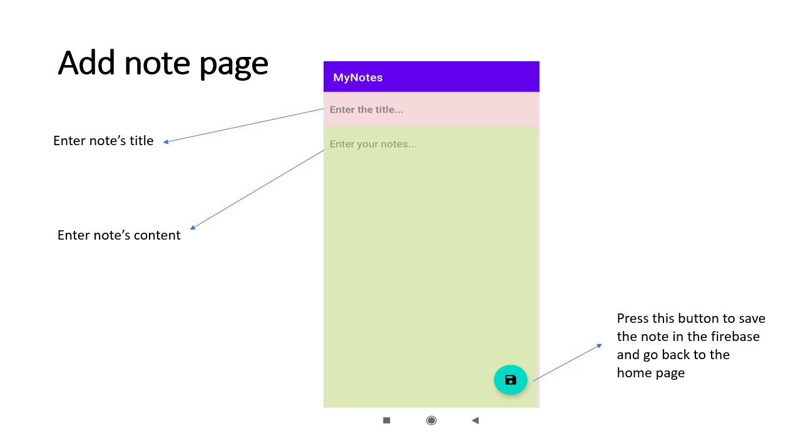

# Edit Note
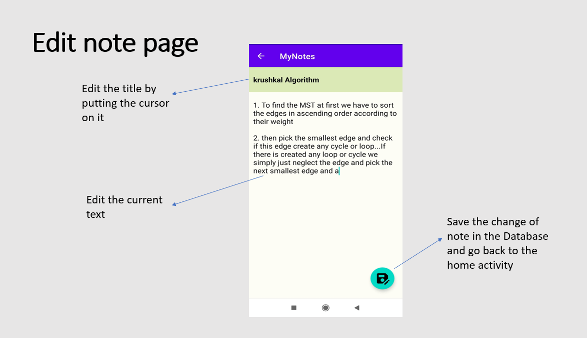

# PopUp Menu 
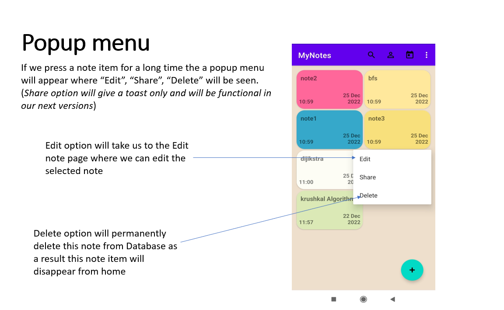

# Searching 
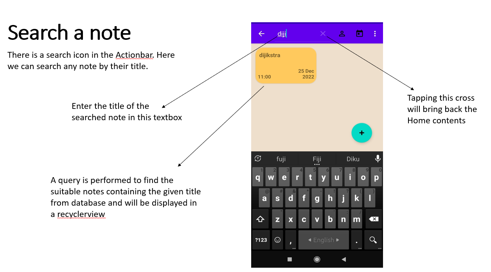

# ActionBar
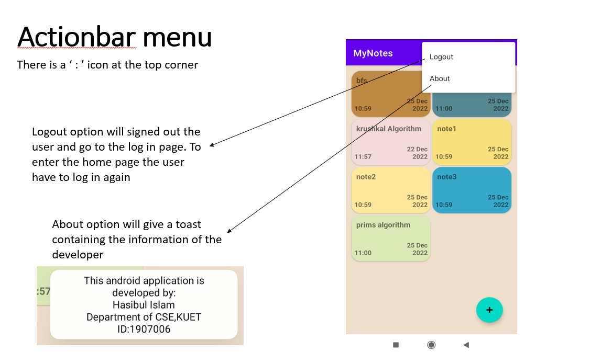

# Tasks
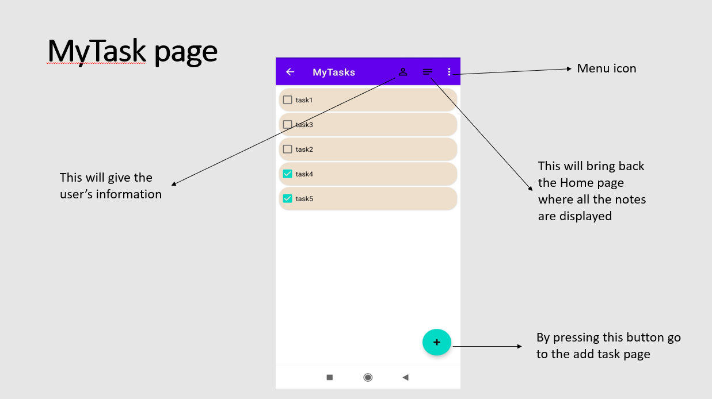

# Add Task
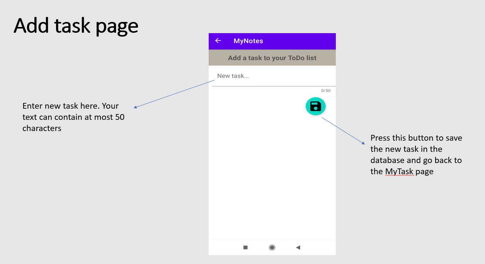

# FireBase Realtime Database 
Store task’s contents in Firebase Realtime Database

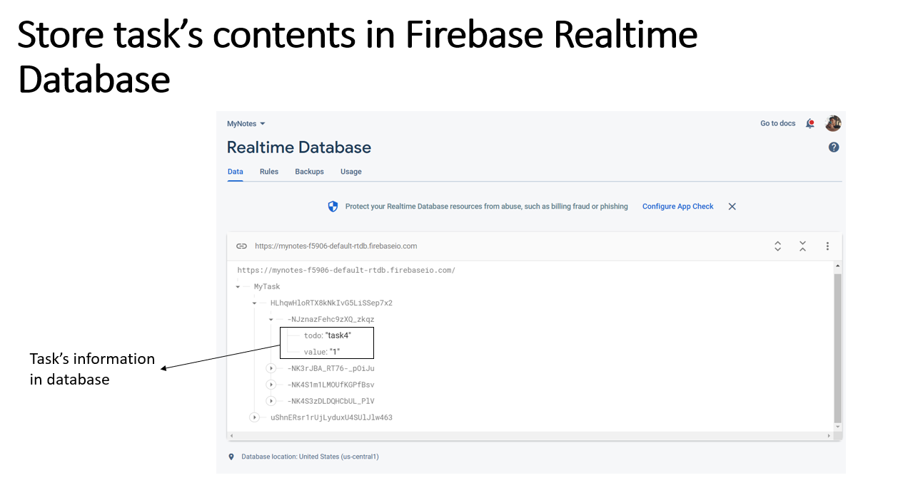

# CheckBox
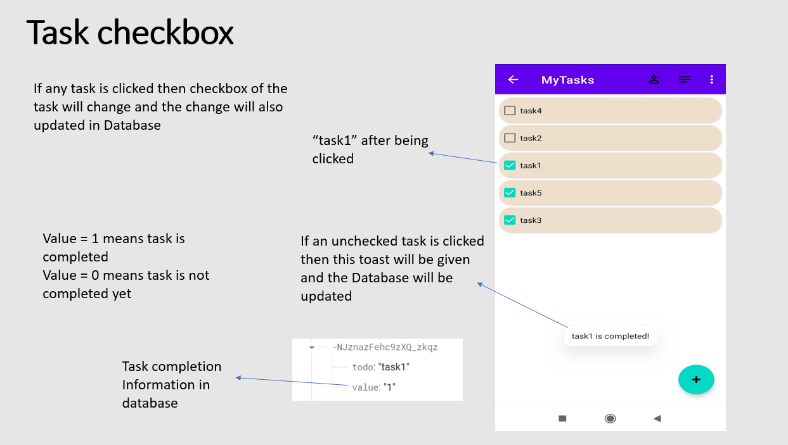

# Task PopUp Menu
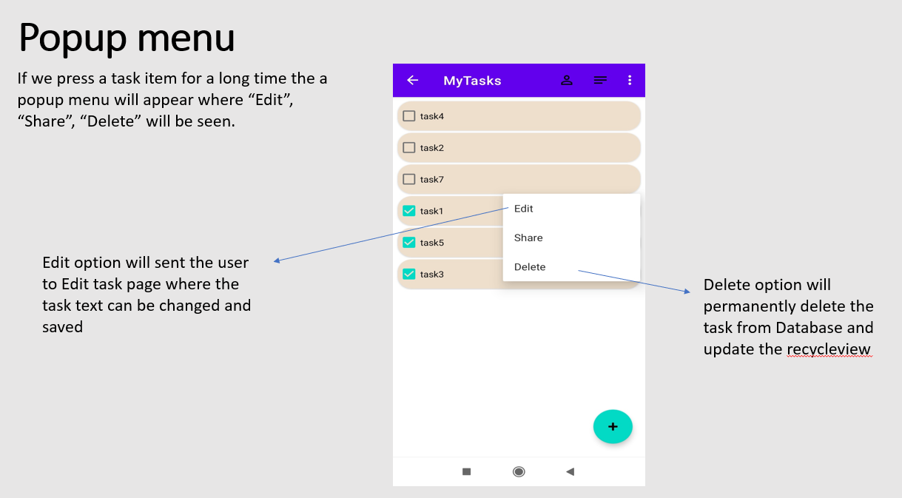

# Edit Task
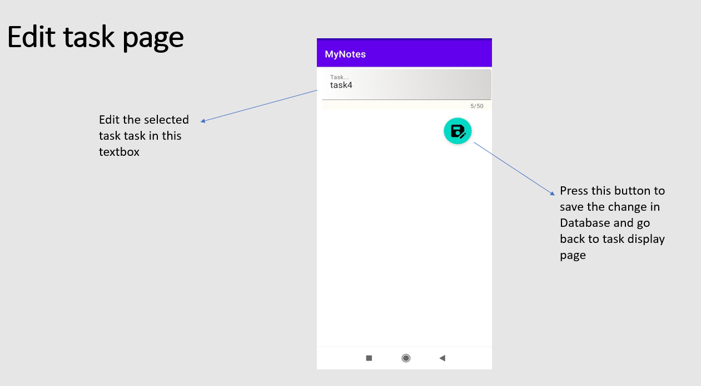

# Limitations
  - As this app fetches data directly from Firebase database, note/task addition or editing is not possible without internet connection
  - As it is a test project data security is very weak
# Future Plan
  - Share note content in social media apps like Facebook ,Twitter etc.
  - Transform text into audible voice 
  - Write a note using hand in a drawable board
  - Add image, video, pdf along with text

